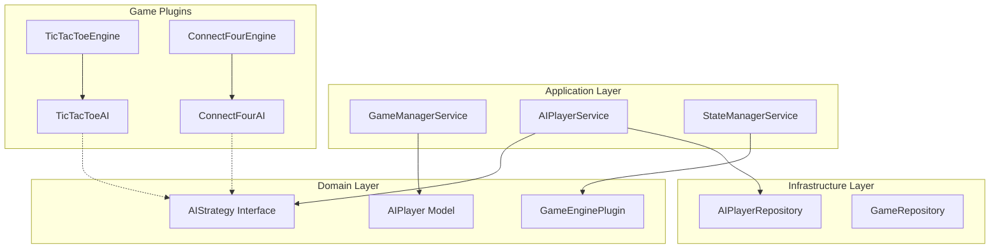
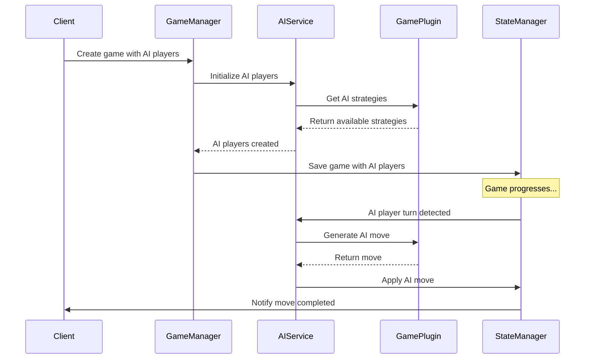

# AI Player System Design Document

## Overview

The AI Player System introduces computer-controlled opponents to the async boardgame service, enabling single-player gameplay while maintaining the existing turn-based architecture. The system extends the current plugin-based architecture to allow each game type to define custom AI strategies, difficulty levels, and behaviors.

The design follows the existing hexagonal architecture pattern, introducing AI-specific interfaces and implementations that integrate seamlessly with the current game management flow. AI players are treated as separate entities from human players but participate in games through the same state management and turn progression mechanisms.

## Architecture

### High-Level Architecture



### AI Integration Flow



## Components and Interfaces

### Core AI Interfaces

```typescript
/**
 * AI Player entity - separate from human players
 */
interface AIPlayer {
  id: string;
  name: string;
  gameType: string;
  strategyId: string;
  difficulty?: string;
  configuration?: Record<string, any>;
  createdAt: Date;
}

/**
 * AI Strategy interface implemented by game plugins
 */
interface AIStrategy {
  id: string;
  name: string;
  description: string;
  difficulty?: string;
  
  /**
   * Generate a move for the AI player
   * @param state Current game state
   * @param aiPlayerId ID of the AI player making the move
   * @returns Promise resolving to a valid move
   */
  generateMove(state: GameState, aiPlayerId: string): Promise<Move>;
  
  /**
   * Validate AI-specific configuration
   * @param config Configuration to validate
   * @returns true if valid, false otherwise
   */
  validateConfiguration?(config: Record<string, any>): boolean;
}

/**
 * Extended game plugin interface with AI support
 */
interface AICapableGamePlugin extends GameEnginePlugin {
  /**
   * Get available AI strategies for this game type
   * @returns Array of AI strategies
   */
  getAIStrategies(): AIStrategy[];
  
  /**
   * Get default AI strategy for this game type
   * @returns Default AI strategy
   */
  getDefaultAIStrategy(): AIStrategy;
  
  /**
   * Create an AI player for this game type
   * @param name Display name for the AI player
   * @param strategyId ID of the strategy to use
   * @param difficulty Optional difficulty level
   * @returns AI player configuration
   */
  createAIPlayer(name: string, strategyId?: string, difficulty?: string): AIPlayer;
}
```

### AI Player Service

```typescript
/**
 * Service for managing AI players and their moves
 */
class AIPlayerService {
  constructor(
    private pluginRegistry: PluginRegistry,
    private aiRepository: AIPlayerRepository,
    private gameRepository: GameRepository
  ) {}

  /**
   * Create AI players for a game
   * @param gameType Type of game
   * @param aiPlayerConfigs Configuration for each AI player
   * @returns Created AI players
   */
  async createAIPlayers(
    gameType: string, 
    aiPlayerConfigs: AIPlayerConfig[]
  ): Promise<AIPlayer[]>;

  /**
   * Generate and apply AI move when it's AI's turn
   * @param gameId Game ID
   * @param aiPlayerId AI player ID
   * @returns Updated game state
   */
  async processAITurn(gameId: string, aiPlayerId: string): Promise<GameState>;

  /**
   * Check if a player is an AI player
   * @param playerId Player ID to check
   * @returns true if AI player, false otherwise
   */
  async isAIPlayer(playerId: string): Promise<boolean>;

  /**
   * Get AI strategies available for a game type
   * @param gameType Game type
   * @returns Available AI strategies
   */
  getAvailableStrategies(gameType: string): AIStrategy[];
}
```

### Turn Management Integration

The existing `StateManagerService` will be extended to detect AI player turns and automatically trigger AI move generation:

```typescript
/**
 * Extended StateManagerService with AI support
 */
class StateManagerService {
  // ... existing methods ...

  /**
   * Apply a move and handle turn progression with AI support
   */
  async applyMove(gameId: string, playerId: string, move: Move): Promise<GameState> {
    // Apply human move using existing logic
    const updatedState = await this.applyMoveInternal(gameId, playerId, move);
    
    // Check if next player is AI and trigger AI move
    await this.processAITurnsIfNeeded(updatedState);
    
    return updatedState;
  }

  /**
   * Process consecutive AI turns until human player or game end
   */
  private async processAITurnsIfNeeded(state: GameState): Promise<void> {
    let currentState = state;
    
    while (!this.isGameOver(currentState)) {
      const currentPlayerId = this.getCurrentPlayer(currentState);
      
      if (!(await this.aiPlayerService.isAIPlayer(currentPlayerId))) {
        break; // Human player's turn
      }
      
      // Process AI turn
      currentState = await this.aiPlayerService.processAITurn(
        currentState.gameId, 
        currentPlayerId
      );
    }
  }
}
```

## Data Models

### AI Player Model

```typescript
/**
 * AI Player domain model
 */
class AIPlayer {
  constructor(
    public readonly id: string,
    public readonly name: string,
    public readonly gameType: string,
    public readonly strategyId: string,
    public readonly difficulty?: string,
    public readonly configuration?: Record<string, any>,
    public readonly createdAt: Date = new Date()
  ) {}

  /**
   * Create a regular Player object for game participation
   */
  toPlayer(): Player {
    return {
      id: this.id,
      name: this.name,
      joinedAt: this.createdAt,
      metadata: {
        isAI: true,
        strategyId: this.strategyId,
        difficulty: this.difficulty,
        configuration: this.configuration
      }
    };
  }
}
```

### AI Configuration

```typescript
/**
 * Configuration for creating AI players
 */
interface AIPlayerConfig {
  name: string;
  strategyId?: string; // Optional - uses default if not specified
  difficulty?: string;
  configuration?: Record<string, any>;
}

/**
 * AI move generation context
 */
interface AIMoveContext {
  gameState: GameState;
  aiPlayer: AIPlayer;
  timeLimit?: number; // milliseconds
  retryCount?: number;
}
```

## Correctness Properties

*A property is a characteristic or behavior that should hold true across all valid executions of a system-essentially, a formal statement about what the system should do. Properties serve as the bridge between human-readable specifications and machine-verifiable correctness guarantees.*

Based on the prework analysis, the following properties ensure the AI system behaves correctly:

**Property 1: AI Player Unique Identification**
*For any* game created with AI players, all player IDs should be unique and AI players should be identifiable through metadata
**Validates: Requirements 1.3, 4.1**

**Property 2: AI Move Validation Consistency**
*For any* AI-generated move, the move should pass the same validation rules that apply to human player moves
**Validates: Requirements 2.2**

**Property 3: Automatic AI Turn Processing**
*For any* game state where it becomes an AI player's turn, the system should automatically trigger move generation and apply the move within the time limit
**Validates: Requirements 2.1, 2.5**

**Property 4: AI Strategy Availability**
*For any* registered game type, the game plugin should provide at least one AI strategy, with a default strategy always available
**Validates: Requirements 3.1, 3.5**

**Property 5: AI Move Generation Interface Compliance**
*For any* AI strategy implementation, calling the move generation interface with valid game state should return valid moves within the time limit
**Validates: Requirements 3.2, 3.4**

**Property 6: Game State Structure Consistency**
*For any* game containing AI players, the game state structure and API responses should be identical to human-only games except for player type metadata
**Validates: Requirements 4.2, 5.1**

**Property 7: AI Player Persistence**
*For any* game with AI players, saving and loading the game should preserve all AI player state and configuration data
**Validates: Requirements 4.5**

**Property 8: Move History Consistency**
*For any* game with AI players, AI moves should appear in move history with proper timestamps using the same format as human moves
**Validates: Requirements 5.2, 5.5**

**Property 9: Tic-Tac-Toe AI Optimality**
*For any* tic-tac-toe game state, the perfect-play AI strategy should never make a suboptimal move when winning or blocking moves are available
**Validates: Requirements 6.2**

**Property 10: AI Performance Requirements**
*For any* AI move generation in tic-tac-toe, the move should be generated and applied within 1 second
**Validates: Requirements 6.4**

**Property 11: AI Error Logging Context**
*For any* AI error that occurs, the logged error should include sufficient debugging context including game state and AI configuration
**Validates: Requirements 7.5**

## Error Handling

### AI-Specific Error Types

```typescript
/**
 * AI-specific error classes
 */
class AIStrategyNotFoundError extends Error {
  constructor(gameType: string, strategyId: string) {
    super(`AI strategy '${strategyId}' not found for game type '${gameType}'`);
  }
}

class AIMoveGenerationError extends Error {
  constructor(aiPlayerId: string, cause?: Error) {
    super(`AI player '${aiPlayerId}' failed to generate move: ${cause?.message}`);
    this.cause = cause;
  }
}

class AITimeoutError extends Error {
  constructor(aiPlayerId: string, timeLimit: number) {
    super(`AI player '${aiPlayerId}' exceeded time limit of ${timeLimit}ms`);
  }
}
```

### Error Handling Strategy

1. **Move Generation Failures**: Retry up to 3 times with exponential backoff
2. **Timeout Handling**: 1-second default timeout with configurable limits per game type
3. **Invalid Move Recovery**: Request new move from AI, log error for debugging
4. **Critical Failures**: Gracefully end game or skip AI turn with player notification
5. **Logging**: Comprehensive error logging with game state context for debugging

## Testing Strategy

### Unit Testing Approach

Unit tests will focus on individual components and their specific behaviors:

- **AI Player Service**: Test AI player creation, move generation coordination, and error handling
- **AI Strategy Implementations**: Test move generation logic for various game states
- **Game Plugin Extensions**: Test AI strategy registration and configuration
- **Turn Management**: Test automatic AI turn detection and processing
- **Error Scenarios**: Test timeout handling, invalid move recovery, and failure modes

### Property-Based Testing Approach

Property-based tests will verify universal behaviors across all game types and AI strategies using **fast-check** library with minimum 100 iterations per test:

- **Property 1 Test**: Generate random game states and AI players, verify all AI-generated moves pass validation
- **Property 2 Test**: Create games with AI players, verify AI moves are generated within time limits
- **Property 3 Test**: Generate games with mixed human/AI players, verify correct player type identification
- **Property 4 Test**: Test all registered game types have at least one available AI strategy
- **Property 5 Test**: Compare game states with AI players vs human-only games for structural consistency
- **Property 6 Test**: Inject AI failures and verify graceful error handling without state corruption
- **Property 7 Test**: Generate tic-tac-toe positions and verify AI never makes suboptimal moves

Each property-based test will be tagged with comments referencing the specific correctness property from this design document using the format: **Feature: ai-player-system, Property {number}: {property_text}**

### Integration Testing

Integration tests will verify the complete AI player workflow:

- Game creation with AI players through REST API
- AI move generation and application in real game scenarios
- Mixed human/AI gameplay sessions
- Error handling in production-like conditions
- Performance testing for AI move generation times

### Tic-Tac-Toe AI Testing

Specific tests for the tic-tac-toe AI implementation:

- Perfect play verification against known optimal strategies
- Win/block/center priority testing
- Performance benchmarks for move generation
- Edge case handling (nearly full boards, immediate wins/blocks)