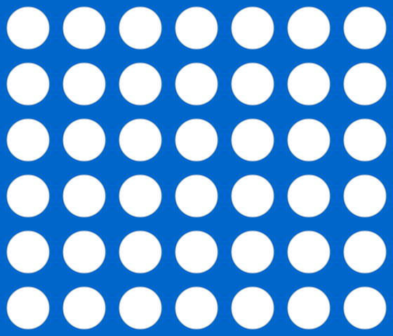
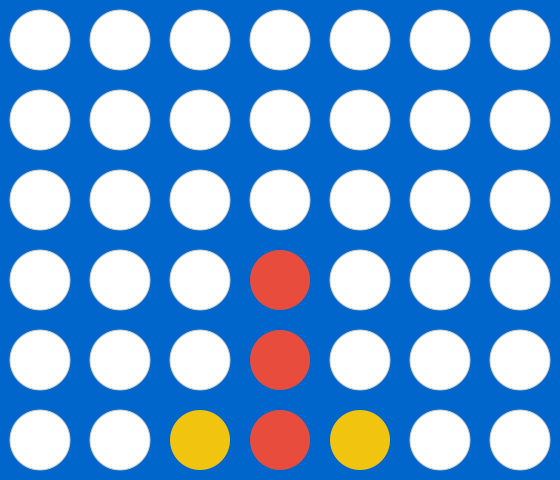
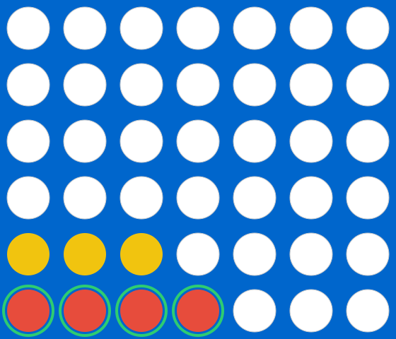
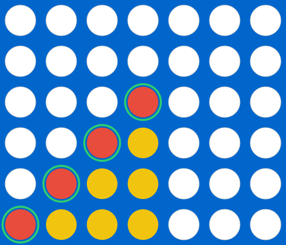
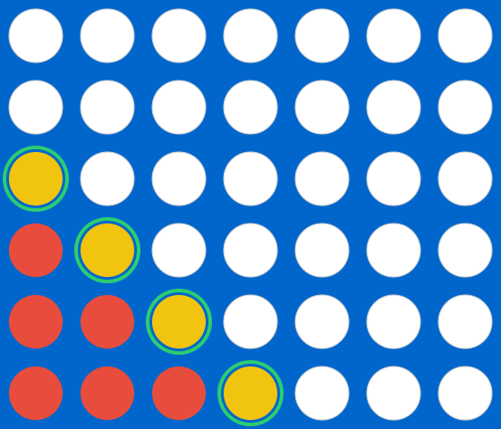
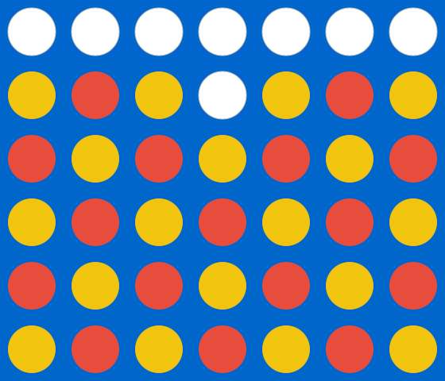

# Connect Four SVG Examples

This directory contains example SVG renderings of Connect Four game states, generated by the Connect Four rendering engine.

## Examples

### 1. Empty Board


A fresh Connect Four board with no discs placed. All 42 positions (7 columns × 6 rows) are empty and shown as white circles.

### 2. Game in Progress


A game in progress showing red and yellow discs placed in various positions. Demonstrates the gravity mechanic where discs fall to the lowest available position in each column.

### 3. Horizontal Win


Red player wins with four consecutive discs in a horizontal line at the bottom row. The winning discs are highlighted with a green outline.

### 4. Vertical Win


Yellow player wins with four consecutive discs in a vertical line in column 3. The winning discs are highlighted with a green outline.

### 5. Diagonal Win (Ascending)


Red player wins with four consecutive discs in an ascending diagonal line (bottom-left to top-right). The winning discs are highlighted with a green outline.

### 6. Diagonal Win (Descending)


Yellow player wins with four consecutive discs in a descending diagonal line (top-left to bottom-right). The winning discs are highlighted with a green outline.

### 7. Nearly Full Board


A board that is almost completely filled with discs, demonstrating a complex game state with multiple columns nearly full.

## Generating Examples

To regenerate these SVG examples, run:

```bash
npx ts-node games/connect-four/scripts/generate-svg-examples.ts
```

## Technical Details

- **Board Dimensions**: 7 columns × 6 rows (42 total positions)
- **Cell Size**: 80px × 80px
- **Disc Radius**: 30px
- **Colors**:
  - Red Player: `#e74c3c`
  - Yellow Player: `#f1c40f`
  - Empty Cells: `white` with light gray border
  - Board Background: `#0066cc` (blue)
  - Win Highlight: `#2ecc71` (green) with 4px stroke

## Rendering Layers

Each SVG is composed of three layers (in z-index order):

1. **Grid Layer** (z-index: 1): Board background, grid lines, and border
2. **Discs Layer** (z-index: 2): All 42 disc positions (empty, red, or yellow)
3. **Win Highlight Layer** (z-index: 3): Green outline around winning discs (only for completed games)

## Usage in Documentation

These SVG files can be embedded in markdown documentation, used in presentations, or referenced in API documentation to illustrate game states and win conditions.
